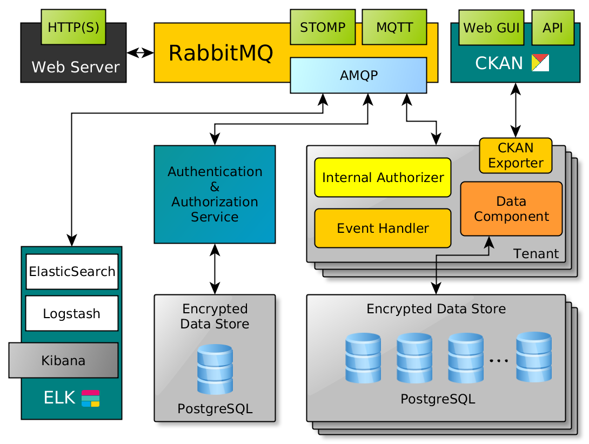

# LIFE PAYT SOFTWARE

## Software Description

This software aims to retrieve and present information about the usage of PAYT (Pay-as-you-throw) systems. The data can be retrieved through specific API's or directly implemented in the software platform. The client information can be added by uploading Excel files that the municipalities have. Through Excel files can also be added billing information if the municipality decides to calculate the fees outside of this platform.

The file parsers accept xsl or csv file formats and can adapted as desired. There is also a module called 'api_worker' which represents an example of how the data can be obtained from an specific API. There will be published an API for the users of this software to send their data, rather than the portal itself gathering all the data, giving control to the entities for posting data as will.

This software was built with multitenancy in mind, which means that each municipality can have its own database and software running without interfearance from others. To add new municipalities, or tenants, the Makefile or the Docker compose file can easily be modified for that purpose.

In each module there is a package that is installed within each container named 'yaasc', which creates an interface for the async.io library. You can add this to a repo and download it whenever the container is executed.

## General information

The 2 main modules, 'auth' and tenant, communicate through the RabbitMQ instance, therefore messages. Those messages are handled by the yaasc module, which implements the RabbitMQ methods with the asyncio library (https://docs.python.org/3/library/asyncio.html). Therefore in order to make calls of functions from any module, they have to be registered when starting it through the method 'register' whithin each module. This happens right before the instance connects to the communication module by calling for example:
'await self._payt_client.register("payt.auth.payt_login", self.payt_login)'
This make the method 'payt_login' available for other modules to call via RabbitMQ and asyncio with the string 'payt.auth.payt_login'.

Therefore in order to make any method unaccessible or otherwise, this call has to be either deleted or added to the '_on_payt_connect()' method, otherwise it will not work.

As said before, each module has its own database, applying a multitenancy concept. For each module there is a database handler called 'dbfuncs.py' in a separate folder. This modules make calls to the PostgreSQL database and the queries are build with the strings declared in the queries.py file and the 'aiopg' library which can sanitize input for avoiding SQL Injection attacks.

## Authentication Module
### System keys and admin login
The authentication module handles all the users across all the counties (tenants). It also handles the authorization keys for the services to connect to the PAYT Platform. The files are ready for usage as a demo, but in order to put into production some changes have to be made. Whether the Makefile or Dockefile is used to deploy the system, admin password and service keys have to be defined and added to the database.

In order to do that, when the system starts for the first time, the 'auth' module creates those entries in the database (see line 94-97 in auth.py). The advice is when putting into production to change not only the values there, but also in the Makefile or Dockerfile, so that the services can connect to the RabbitMQ instance.

### 

## Tenant Module

## Web Application

## Access control

## Execution and setup

To start executing the whole system there are two ways to do it: through the Makefile or directly from the Docker compose file. In the Docker compose file there is no database initiated. This is because it is primarly used on the production server which had a local database. The Makefile which was used for local testing required a test database and that runned in an isolated container.

So to run this software locally, the recommendation is to use the Makefile which creates the databases and gets everything running.

The most important commands to run with the makefile are: 'build_all' and 'run_all', which can be executed by the command 'all'.